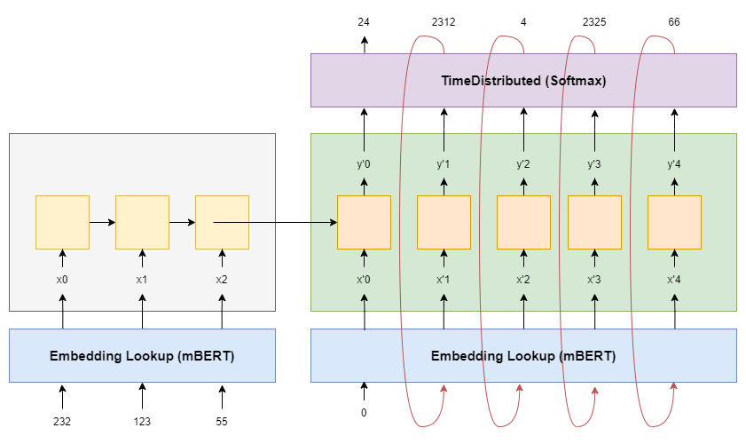

# 🚀 Neural Machine Translation: English to Hindi 🚀

Welcome to the repository for my Neural Machine Translation project, where I tackled the challenge of translating English to Hindi. This project showcases two significant milestones:

### Custom Embeddings Training:

* In the initial phase, I trained custom word embeddings to power the translation model.
* Despite the effort, the validation loss stood at 3.5, reflecting the complexities of language translation.

### Leveraging mBERT:

* I adopted mBERT (Multilingual BERT) as a game-changing approach.
With mBERT's multilingual prowess, the project achieved remarkable results, boasting a validation loss below 0.8.
* This repository houses the code and resources for both phases, providing insights into the journey from custom embeddings to the transformative impact of mBERT. Explore the code, data, and models to see the evolution of this project.

### Approach 

 
